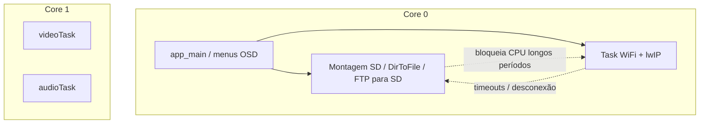

# Conflito SD Card vs WiFi — Análise do Firmware ESPectrum_wifi

**Plano de ação (checklist):** [plano-acao-sd-wifi.md](./plano-acao-sd-wifi.md)

Documento gerado a partir da investigação do firmware. Descreve as hipóteses sobre o sintoma reportado: **ao aceder ao cartão SD surgem problemas no WiFi, e vice-versa**.

---

## Resumo executivo

No ESP32, o **WiFi não partilha o barramento SPI externo** com o cartão SD. O rádio é interno; o SD usa **HSPI** (`SPI2_HOST`) em GPIO dedicados. O conflito observado encaixa melhor em:

- Contenção de **CPU e flash** no **core 0**
- Operações SD **bloqueantes** sem coordenação com a stack WiFi
- **Reinicialização incorreta** do WiFi a cada conexão
- Pressão de **memória/barramentos** em builds com PSRAM
- Possíveis fatores de **hardware** (GPIO2, alimentação)

---

## Arquitetura relevante

### Pinagem do SD (`include/hardpins.h`)

| Sinal | TTGO / ESPectrum | Olimex SBC-FABGL |
|-------|------------------|------------------|
| MISO  | GPIO 2           | GPIO 35          |
| MOSI  | GPIO 12          | GPIO 12          |
| CLK   | GPIO 14          | GPIO 14          |
| CS    | GPIO 13          | GPIO 13          |

Montagem em `src/FileUtils.cpp`: `spi_bus_initialize(SPI2_HOST, ...)`, `esp_vfs_fat_sdspi_mount` em `/sd`, frequência máxima `SDCARD_HOST_MAXFREQ` (19 MHz).

### WiFi e rede

Implementação em `src/NetworkMenu.cpp`: STA, NVS namespace `"storage"`, cliente FTP passivo. O WiFi **não é inicializado no boot** — só ao abrir o menu de rede (`src/OSDMain.cpp`).

### Distribuição de cores (build `psram`)

| Recurso        | Core 0                          | Core 1              |
|----------------|----------------------------------|---------------------|
| `app_main` / menus OSD | Sim                      | —                   |
| Task WiFi + lwIP       | Sim (`CONFIG_ESP32_WIFI_TASK_PINNED_TO_CORE_0`) | — |
| Vídeo / áudio          | —                        | Sim (prioridade alta) |

Enquanto um menu OSD está aberto, `OSD::menuRun` entra num `while(1)` com `vTaskDelay(5)` — o emulador não corre, mas **I/O de SD e rede executam neste contexto** no core 0.



---

## O que NÃO é a causa principal

### Partilha do barramento SPI entre SD e WiFi

O WiFi do ESP32 **não utiliza** o HSPI ligado ao cartão. Partilha de SPI com o SD só ocorreria se outro periférico (display, etc.) usasse o mesmo host — neste projeto o SD é o único cliente explícito em `SPI2_HOST` via `FileUtils`.

---

## Hipóteses detalhadas

### Hipótese A — Contenção CPU e flash no core 0 (principal)

**Probabilidade: alta**

**Descrição:** A task principal, os menus OSD, a task WiFi e o lwIP competem pelo **mesmo core (0)**. Operações SD longas (indexação de diretórios, download FTP) bloqueiam esse contexto durante segundos, privando a stack WiFi de tempo de CPU.

**Evidências:**

- `CONFIG_ESP_MAIN_TASK_AFFINITY_CPU0` e `CONFIG_ESP32_WIFI_TASK_PINNED_TO_CORE_0` em `sdkconfig.psram`
- `FileUtils::DirToFile` — `readdir`, ordenação em RAM, múltiplos `fopen`/`fwrite` — chamado a partir de `src/OSDFile.cpp` ao abrir o browser de ficheiros
- `NetworkMenu::ftpDownload` — loop `recv` + `fwrite` sem `vTaskDelay` no caminho crítico
- Comentário em `src/ESP32Lib/I2S/I2S.cpp` sobre exceções com acesso concorrente à **flash** (código WiFi + FAT/VFS do SD na mesma flash)

**Sintomas esperados:**

- WiFi desliga ou deixa de responder durante indexação SD
- Timeouts FTP ou falhas ao gravar no SD com WiFi ativo
- Comportamento intermitente sob carga

**Ficheiros:** `src/OSDMenu.cpp`, `src/FileUtils.cpp`, `src/NetworkMenu.cpp`, `sdkconfig.psram`

---

### Hipótese B — Reinicialização incorreta do WiFi

**Probabilidade: alta**

**Descrição:** Cada chamada a `NetworkMenu::wifiConnect` executa `esp_wifi_init` e regista handlers de evento, **sem** `esp_wifi_deinit`, `esp_wifi_stop` ou `esp_event_handler_unregister` em qualquer parte do projeto.

**Evidências (`src/NetworkMenu.cpp`):**

```cpp
esp_wifi_init(&icfg);
esp_event_handler_register(WIFI_EVENT, ESP_EVENT_ANY_ID,    wifi_evt_handler, nullptr);
esp_event_handler_register(IP_EVENT,   IP_EVENT_STA_GOT_IP, wifi_evt_handler, nullptr);
esp_wifi_start();
esp_wifi_connect();
```

Não existe `esp_wifi_deinit` no repositório (grep sem resultados).

**Sintomas esperados:**

- Primeira conexão OK; falhas após reconectar ou alternar entre menu rede e ficheiros
- Handlers duplicados, estado interno inconsistente (`ESP_ERR_INVALID_STATE` em `esp_wifi_init`)
- Utilizador associa o problema ao uso do SD, embora a causa seja acumulação de estado WiFi

**Correção sugerida:** Inicializar WiFi **uma vez**; nas reconexões usar apenas `esp_wifi_set_config` + `esp_wifi_connect` (ou `disconnect` + `connect`).

---

### Hipótese C — Pressão PSRAM + SPI do SD

**Probabilidade: média** (builds com PSRAM)

**Descrição:** Em `sdkconfig.psram`, `CONFIG_SPIRAM_TRY_ALLOCATE_WIFI_LWIP=y` coloca buffers de rede em PSRAM. O SD usa HSPI em GPIO 12/14/13 (e MISO em 2 ou 35). Tráfego intenso no SPI do SD em simultâneo com acesso frequente à PSRAM (WiFi + framebuffer) aumenta latência e erros aparentes de “conflito”.

**Evidências:**

- PSRAM em pinos dedicados (sdkconfig: CLK=17, CS=16)
- Indexação SD e download FTP intensificam ambos os barramentos
- Build `nopsram` não tem `SPIRAM_TRY_ALLOCATE_WIFI_LWIP` da mesma forma

**Sintomas esperados:**

- Pior desempenho no env `psram` que no `nopsram` para as mesmas operações mistas
- Erros `EIO` no SD sob WiFi ativo sem desligar o cartão fisicamente

---

### Hipótese D — Configuração sdkconfig desfavorável ao WiFi (PSRAM)

**Probabilidade: média**

**Descrição:** No build **com PSRAM**, otimizações WiFi em IRAM estão **desligadas**, ao contrário do build `nopsram`.

| Opção | `sdkconfig.psram` | `sdkconfig.nopsram` |
|-------|-------------------|---------------------|
| `CONFIG_ESP32_WIFI_IRAM_OPT` | desligado | **ligado** |
| `CONFIG_SPIRAM_TRY_ALLOCATE_WIFI_LWIP` | ligado | — |
| `CONFIG_ESP_TASK_WDT` | desligado | desligado |

Mais código WiFi na **flash** aumenta contenção com o sistema de ficheiros FAT no SD (também via flash/VFS).

**Correção sugerida:** Ativar `CONFIG_ESP32_WIFI_IRAM_OPT` e `CONFIG_ESP32_WIFI_RX_IRAM_OPT` no perfil PSRAM, alinhado ao `nopsram`.

---

### Hipótese E — Ausência de coordenação SD ↔ rede

**Probabilidade: alta** (como agravante)

**Descrição:** Não existe mutex nem política explícita entre acesso ao SD e operações de rede. WiFi pode permanecer ativo durante `DirToFile`, montagem/remount ou FTP longo.

**Evidências:**

- `ftpDownload` chama `FileUtils::isSDReady()` mas não sincroniza com a task WiFi
- Nenhum `xSemaphore` ou flag global de “I/O SD em curso” no código da aplicação

**Correção sugerida:** Mutex `sd_wifi_lock` ou pausar WiFi (`esp_wifi_stop`) durante indexação pesada; recusar FTP se SD estiver a indexar.

---

### Hipótese F — Deteção agressiva de cartão “morto”

**Probabilidade: média**

**Descrição:** `isMountedSDCard()` faz `opendir("/sd")` e trata `EIO` ou `EBADF` como falha permanente, desencadeando `unmountSDCard()` + `spi_bus_free`. Sob carga (WiFi + SD), erros **transitórios** podem desmontar o cartão e amplificar o ciclo de falhas.

**Evidências (`src/FileUtils.cpp`):**

- `isSDReady()` → se montado mas `isMountedSDCard()` falha → `unmountSDCard()`
- `OSDFile.cpp` também chama `unmountSDCard()` em certos erros de diretório

**Correção sugerida:** Retries antes de unmount; aceitar `ESP_ERR_INVALID_STATE` em `spi_bus_initialize` (como no fabGL).

---

### Hipótese G — Hardware: GPIO2 e alimentação

**Probabilidade: média** (placas TTGO / ESPectrum)

**Descrição:** O MISO do SD no **GPIO 2** é pino de strapping e, em muitas TTGO, partilhado com LED/serial. O fabGL documenta que GPIO2 com SD ativo é problemático. Picos de corrente (escrita SD + transmissão WiFi) com USB fraca causam brownout ou erros SPI interpretados como conflito lógico.

**Evidências:**

- `PIN_NUM_MISO_LILYGO_ESPECTRUM = GPIO_NUM_2` em `include/hardpins.h`
- Documentação fabGL: *"GPIO 2 (not usable on TTGO/WROVER with SDCard active)"*

**Mitigações hardware:**

- Cartão SD de qualidade, cabo curto
- Alimentação ≥ 500 mA estável, condensadores perto do ESP32 e do slot SD
- Pull-up adequado na linha MISO se necessário

---

## Mapa de ficheiros

| Tópico | Ficheiro |
|--------|----------|
| Pinos SD | `include/hardpins.h` |
| Mount / unmount / `isSDReady` | `src/FileUtils.cpp` |
| Indexação pesada (`DirToFile`) | `src/FileUtils.cpp` |
| Browser de ficheiros + unmount | `src/OSDFile.cpp` |
| WiFi + FTP | `src/NetworkMenu.cpp` |
| Menu de rede | `src/OSDMain.cpp` (~opção rede) |
| Setup / init SD condicional | `src/ESPectrum.cpp` |
| Loop bloqueante de menus | `src/OSDMenu.cpp` |
| Build PSRAM / WiFi core | `platformio.ini`, `sdkconfig.psram`, `sdkconfig.nopsram` |
| Aviso flash + WiFi | `src/ESP32Lib/I2S/I2S.cpp` |

---

## Plano de testes sugerido

1. **WiFi ligado → browser SNA/TAP** (dispara `DirToFile`): registar desconexões e mensagens serial.
2. **Segunda conexão WiFi** sem reboot: verificar `esp_wifi_init` (`ESP_ERR_INVALID_STATE`).
3. **Build PSRAM** com `CONFIG_ESP32_WIFI_IRAM_OPT=y` repetir teste 1.
4. **WiFi stop antes de indexar SD**: se o SD estabilizar, confirma contenção (não SPI partilhado com WiFi).
5. **Log de heap**: `heap_caps_get_largest_free_block` antes/depois de `DirToFile` com WiFi ativo.

---

## Recomendações de correção (prioridade)

| Prioridade | Ação |
|------------|------|
| 1 | WiFi: init único; reconexão sem `esp_wifi_init` repetido |
| 2 | `vTaskDelay(0)` ou `vTaskDelay(1)` em loops FTP e trechos longos de `DirToFile` |
| 3 | Mutex ou política SD ↔ WiFi (pausar um durante o outro) |
| 4 | Task dedicada para I/O SD pesado (fora do loop de menu no core 0) |
| 5 | `sdkconfig.psram`: ativar `CONFIG_ESP32_WIFI_IRAM_OPT` |
| 6 | Remount SD: retries; `ESP_ERR_INVALID_STATE` em `spi_bus_initialize` |
| 7 | Hardware: alimentação, GPIO2, cartão SD |

---

## Conclusão

O sintoma **SD ↔ WiFi** no ESPectrum_wifi deve ser tratado como **contenção de recursos e bugs de gestão WiFi**, não como partilha direta do SPI do cartão com o rádio. As correções de software com melhor relação impacto/risco são: **inicialização WiFi única**, **ceder CPU nos loops de rede/SD**, e **alinhar sdkconfig PSRAM** com as otimizações WiFi já usadas no build `nopsram`.

---

*Documento de análise — firmware ESPectrum_wifi. Para implementação das correções, ver issues ou PRs associados a este ficheiro.*
